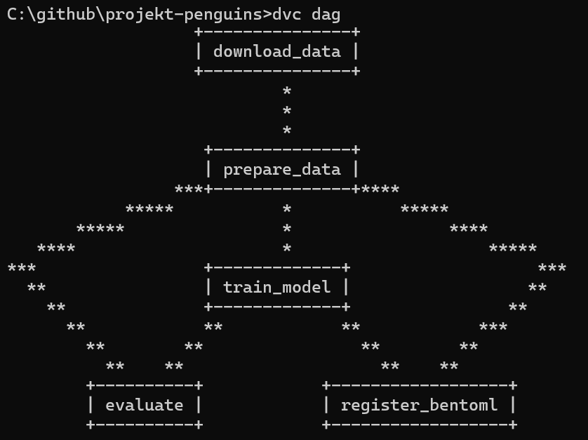
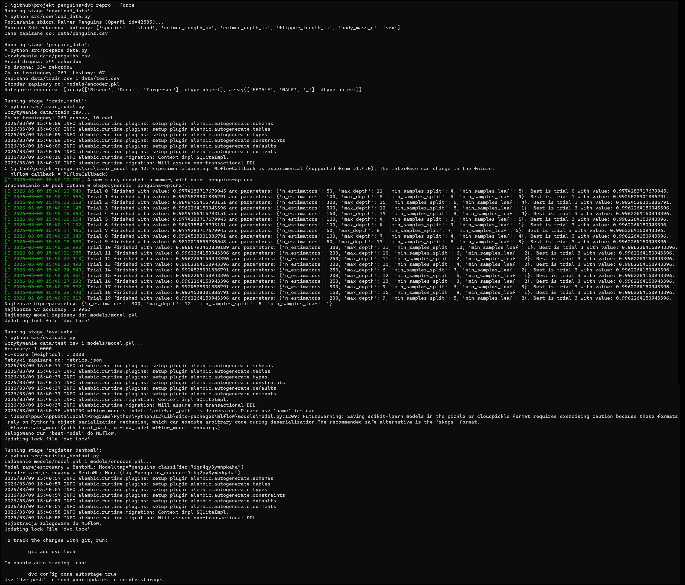
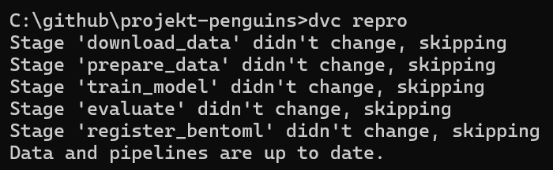
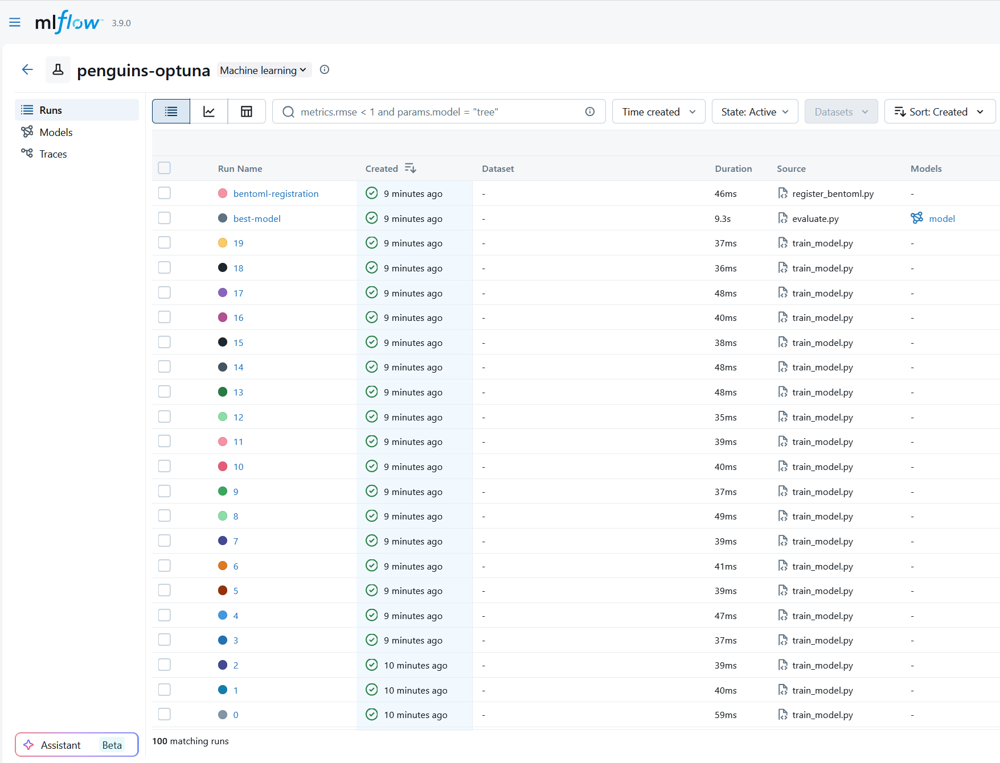
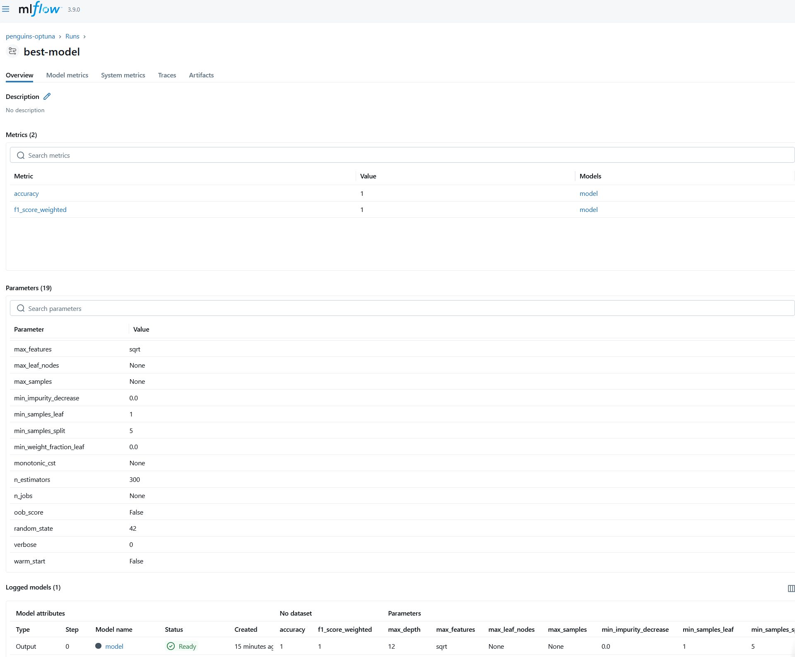
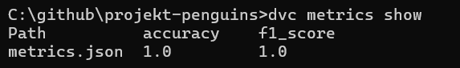
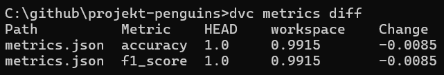
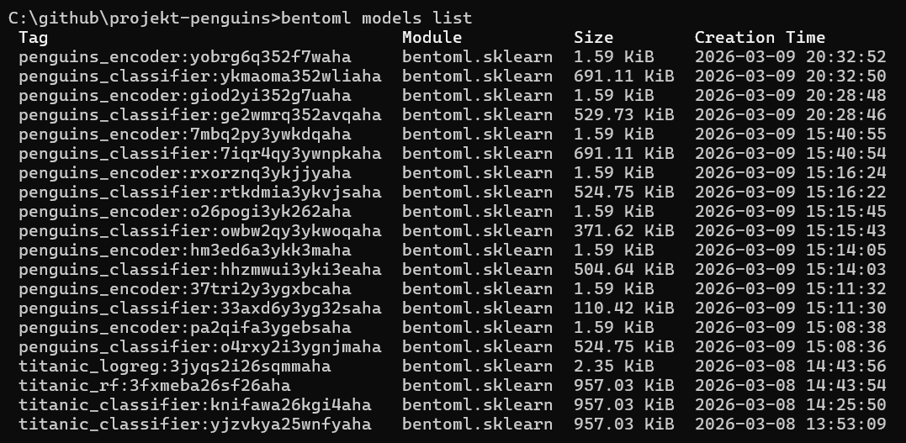
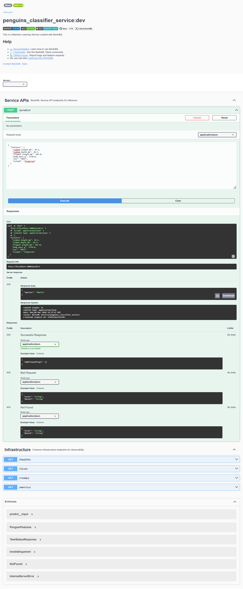

# Palmer Penguins — End-to-End ML Pipeline

Projekt końcowy warsztatów SGGW — Implementacja Systemów AI.
<br>Numer studenta  # k035102@sggw.edu.pl

Klasyfikacja 3 gatunków pingwinów (Adelie, Chinstrap, Gentoo) na zbiorze **Palmer Penguins** (OpenML id: 42585) za pomocą kompletnego pipeline'u: DVC → Optuna → MLflow → BentoML.

---

## Zgodność z wymaganiami

### Zbiór danych
- **OpenML id: 42585** — 344 rekordy, po `dropna()` pozostaje 334
- Cechy numeryczne: `culmen_length_mm`, `culmen_depth_mm`, `flipper_length_mm`, `body_mass_g`
- Cechy kategoryczne: `island` (Biscoe/Dream/Torgersen), `sex` (MALE/FEMALE)

### Preprocessing (vs Titanic)
- Brakujące wartości: `dropna()` zamiast imputacji
- Kodowanie kategoryczne: `OneHotEncoder(sparse_output=False)` zapisany jako `models/encoder.pkl`
- Problem wieloklasowy: metryka `f1_score(average="weighted")`
- Encoder **współdzielony** między pipeline'em DVC a serwisem BentoML

### Pipeline DVC — 5 etapów
```
[download_data] → data/penguins.csv
[prepare_data]  → data/train.csv, data/test.csv, models/encoder.pkl
[train_model]   → models/model.pkl  (Optuna + MLflow, 20 prób)
[evaluate]      → metrics.json      (MLflow run "best-model")
[register_bentoml] → BentoML store
```

### Optuna + MLflow
- Eksperyment: `"penguins-optuna"`, ≥ 20 prób z `MLflowCallback`
- 4 hiperparametry: `n_estimators`, `max_depth`, `min_samples_split`, `min_samples_leaf`
- Ewaluacja: `cross_val_score` 5-fold
- Run `"best-model"` z parametrami, metrykami i modelem z sygnaturą

### BentoML
- Dwa modele w store: `penguins_classifier` + `penguins_encoder`
- Serwis `PenguinsService` z endpointem `POST /predict`
- Wejście: 6 cech (4 numeryczne + island + sex)
- Wyjście: `{"species": "Adelie" | "Chinstrap" | "Gentoo"}`

---

## Struktura projektu

```
projekt-penguins/
├── params.yaml            # Parametry pipeline'u (DVC)
├── dvc.yaml               # Definicja 5 etapów pipeline'u
├── dvc.lock               # Fingerprints etapów (cache DVC)
├── metrics.json           # Metryki ostatniego uruchomienia
├── service.py             # Serwis BentoML /predict
├── bentofile.yaml         # Konfiguracja pakietu BentoML
├── requirements.txt       # Zależności projektu
├── src/
│   ├── download_data.py   # Etap 1: pobieranie z OpenML
│   ├── prepare_data.py    # Etap 2: preprocessing + encoder
│   ├── train_model.py     # Etap 3: Optuna + MLflow
│   ├── evaluate.py        # Etap 4: metryki + MLflow best-model
│   └── register_bentoml.py # Etap 5: rejestracja w BentoML store
├── data/
│   ├── penguins.csv       # Surowe dane (OpenML)
│   ├── train.csv          # Zbiór treningowy
│   └── test.csv           # Zbiór testowy
├── models/
│   ├── model.pkl          # Najlepszy RandomForestClassifier
│   └── encoder.pkl        # OneHotEncoder (island + sex)
└── screens/               # Screenshoty potwierdzające realizację
```

### params.yaml
```yaml
data:
  openml_id: 42585
  test_size: 0.2
  random_state: 42
train:
  n_trials: 20
  cv_folds: 5
  experiment_name: "penguins-optuna"
```

---

## Uruchomienie

```bash
# 1. zależności
pip install -r requirements.txt

# cały pipeline
dvc repro

# sprawdzenie metryk
dvc metrics show

# 4. uruchom serwis predykcji
bentoml serve service:PenguinsService --port 3000
```

### Przykładowe zapytanie API
```bash
curl -X POST http://localhost:3000/predict \
  -H "Content-Type: application/json" \
  -d '{"features": {"culmen_length_mm": 39.1, "culmen_depth_mm": 18.7,
       "flipper_length_mm": 181.0, "body_mass_g": 3750.0,
       "sex": "MALE", "island": "Torgersen"}}'
# → {"species": "Adelie"}
```

---

## Screenshoty

### Screenshot 1 — graf pipeline'u (`dvc dag`)



Graf DAG pokazuje 5 etapów pipeline'u i ich zależności. Etapy wykonywane są sekwencyjnie: `download_data` → `prepare_data` → `train_model` → `evaluate` → `register_bentoml`. *DVC wykrywa zmiany i pomija etapy, których wejścia nie uległy zmianie (cache).

---

### Screenshot 2 — Wykonanie pipeline'u (`dvc repro`)





`dvc repro` uruchamia kolejno wszystkie 5 etapów pipeline'u. Widoczne są logi poszczególnych etapów: pobieranie danych z OpenML, preprocessing (344→334 rekordów po `dropna()`), trenowanie z Optuna (20 prób), ewaluacja i rejestracja w BentoML store.

---

### Screenshot 3 — MLflow UI — lista runów eksperymentu



Interfejs MLflow pokazuje eksperyment `"penguins-optuna"` z ≥ 20 runami wygenerowanymi przez `MLflowCallback` Optuna. Każdy run odpowiada jednej próbie optymalizacji hiperparametrów i zawiera wartość metryki `cv_accuracy`.

---

### Screenshot 4 — MLflow UI — run "best-model"



Run `"best-model"` zawiera najlepsze hiperparametry znalezione przez Optuna (`n_estimators`, `max_depth`, `min_samples_split`, `min_samples_leaf`), metryki na zbiorze testowym (`accuracy`, `f1_score`) oraz zapisany artefakt modelu z sygnaturą (`mlflow.infer_signature`).

---

### Screenshot 5 — Metryki DVC (`dvc metrics show`)



`dvc metrics show` wyświetla zawartość `metrics.json` śledzonego przez DVC. Metryki `accuracy` oraz `f1_score(average="weighted")` dla najlepszego modelu na zbiorze testowym.

---

### Screenshot 6 — Porównanie metryk (`dvc metrics diff`)



`dvc metrics diff` porównuje metryki workspace z aktualnym commitem HEAD. Parametry zostały chwilowo pogorszone (`test_size: 0.35`, `n_trials: 3`), co spowodowało spadek accuracy — widoczna zmiana (`Change`) demonstruje działanie śledzenia metryk przez DVC.

---

### Screenshot 7 — Lista modeli BentoML (`bentoml models list`)



W BentoML store zarejestrowane są dwa modele: `penguins_classifier` (RandomForestClassifier) oraz `penguins_encoder` (OneHotEncoder). Enkoder jest współdzielony — zapisany w etapie `prepare_data` i używany zarówno w `evaluate`, jak i w serwisie `PenguinsService`.

---

### Screenshot 8 — Swagger UI / curl — endpoint `/predict`



Serwis BentoML uruchomiony na porcie 3000 odpowiada na `POST /predict`. Wejście to 6 cech pingwina (4 numeryczne + `island` + `sex`), wyjście to `{"species": "Adelie" | "Chinstrap" | "Gentoo"}`. Preprocessing w serwisie jest identyczny jak w pipeline (ten sam `penguins_encoder` z BentoML store).

<br>
<br>
